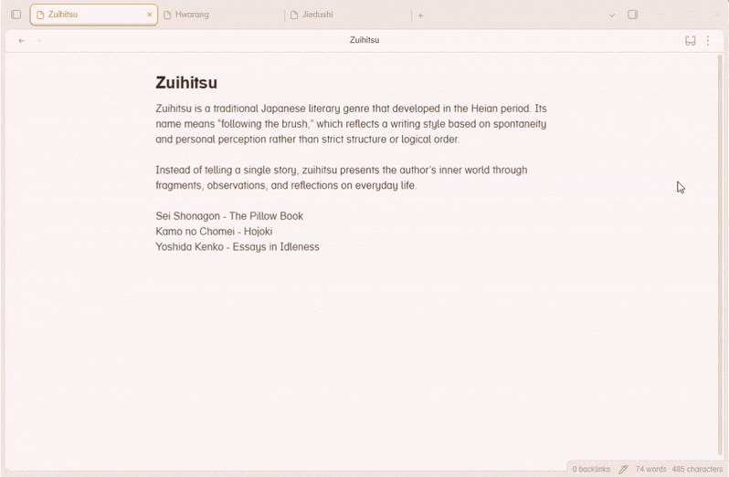
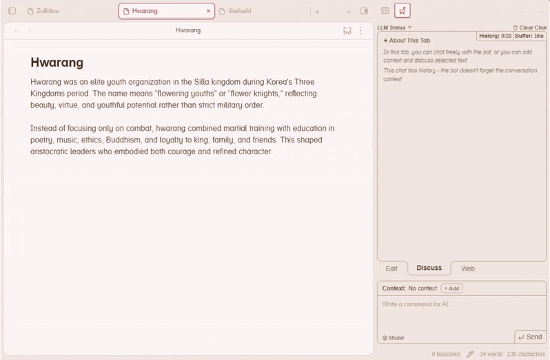
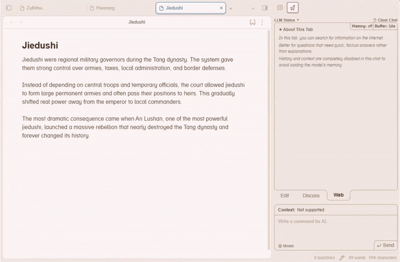
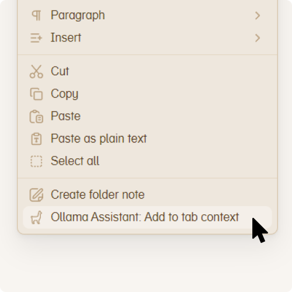
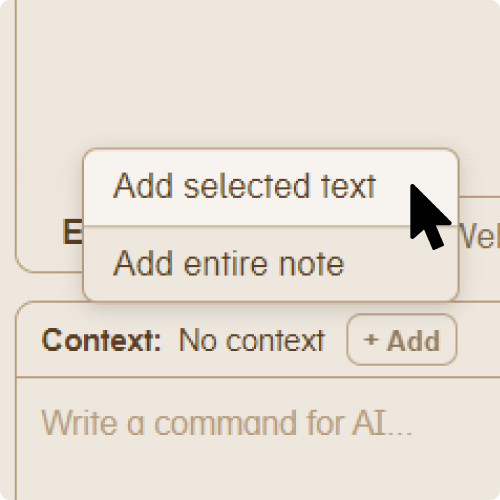
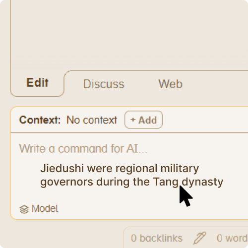

# Ollama Assistant

This plugin connects Ollama to Obsidian, so you can use local LLMs right inside your notes. I focused on making it useful for everyday note-taking and easy to use, with minimal settings.

The plugin has 3 modes: Edit, Discuss, and Web.

**Why three modes?**

The plugin is designed so that even small models (7B or even 4B in some cases) can be truly useful when working with your notes. For this reason, two of the three modes have history disabled. Splitting the plugin into three modes creates three isolated "brains" for different tasks, so even a weak model doesn't get confused and stays focused on the task at hand.

---

### Edit mode

Arguably the main mode. Here you can give the AI a piece of text and an instruction about what to do with it.

The model will explain its actions, then present the edited text. You can apply it to your note, replacing the original. You can also apply the edit while keeping the original text under a spoiler. Or you can send the edited text back into context to continue refining it.

History is fully disabled in this mode for optimization (but you can chain edits by manually adding the edited text back into context).

### Discuss mode

This mode is a regular chat with the AI. It has conversation history — the bot remembers the thread. You can adjust how many messages it remembers in settings. You can also add context from your notes to discuss a specific piece of text.

### Web mode

This mode is for looking up specific information. Small models often hallucinate when it comes to obscure facts. If you need to quickly get a date, a definition, or any precise information while working with text — this mode has you covered.

History and context are disabled in this mode — the model focuses entirely on your search query.

Not all models support this mode. The model must be properly configured for tool calling. In my experience, Qwen family models work great. Most popular cloud models also work well. The plugin automatically detects whether the selected model supports Web mode.

---

### Adding context

You can add context in several ways:

<table width="100%">
  <tr>
    <td width="33%" align="center"> <b>Right-click menu</b></td>
    <td width="33%" align="center"> <b>+Add button</b></td>
    <td width="33%" align="center"> <b>Drag & drop</b></td>
  </tr>
</table>

You can also assign a hotkey for adding context in Settings → Hotkeys (search for "Ollama").

### Additional features

- **Message queue** — no need to wait for the bot to finish responding. Just press Enter to queue your next message, even across tabs
- **Status bar** — shows LLM connection status and generation speed
- **History stored in your vault** — chat history is saved locally, so it syncs across devices with your vault
- **Adjustable bot style** — choose from 3 communication styles to control how the bot responds
- **Quick prompts** — pre-made editing commands for common tasks in Edit mode
- **Pin context** — keep your context pinned so you can give the bot multiple tasks with the same context without re-adding it each time
- **Cloud model support** — works with Ollama cloud models in addition to local ones

### Tested on

- NVIDIA GTX 1060 6GB (Windows)
- Apple Silicon M1 (macOS)

### Acknowledgments

Thanks to the [Ollama](https://ollama.com) team and the [Obsidian](https://obsidian.md) team for their amazing tools.

---

[Ko-fi](https://ko-fi.com/youlin) | [Report a bug or suggest a feature](https://github.com/xlrve/ollama-assistant/issues/new/choose)
